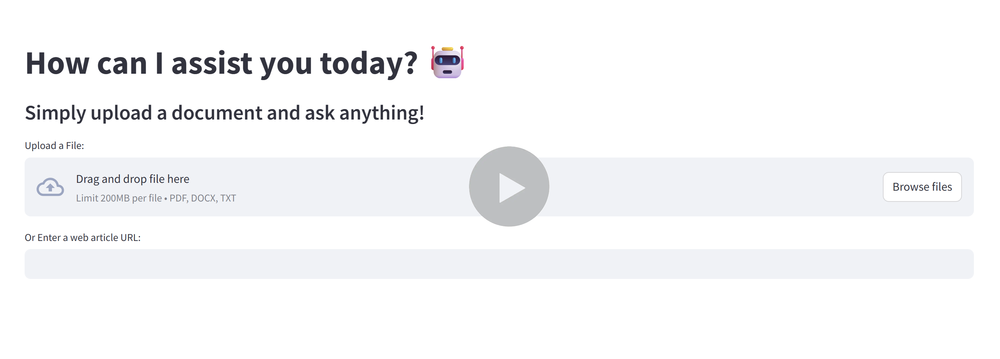
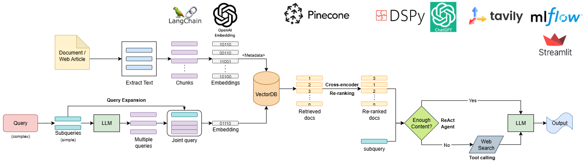
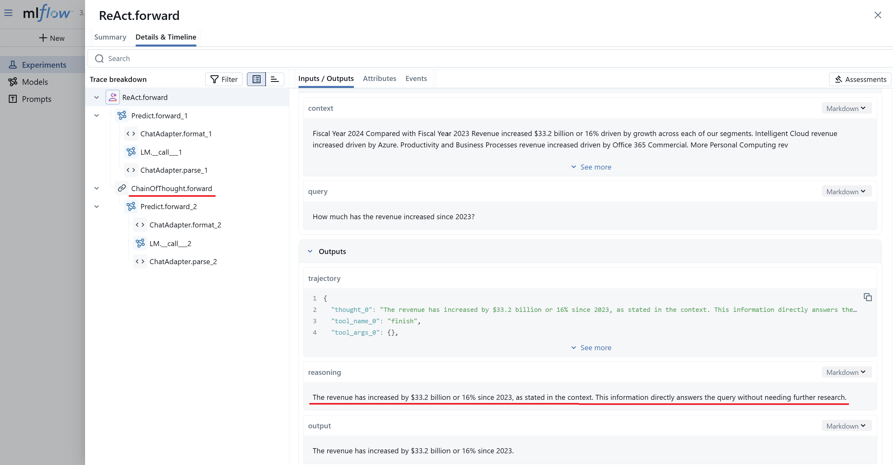
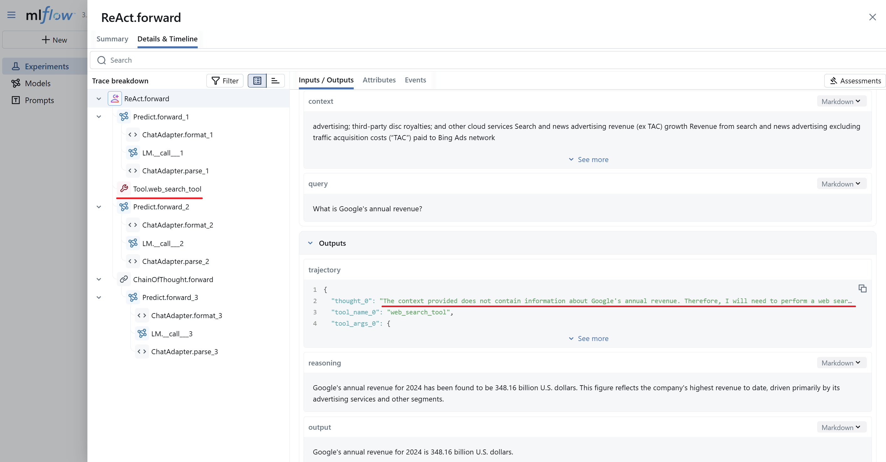

# Agentic RAG
An Advanced Multi-hop Agentic RAG system with:
* Multi-format document Ingestion.
* Query Expansion with Multi-query Augmentation.
* Cross-Encoder Re-ranking.
* Intelligent ReAct Agent for reasoning.
* Web search Tool Calling.
* End-to-End Tracking.

[](https://drive.google.com/file/d/1EiXrJsbNTXtrkE-GgrNWxp80FYGnN2ue/view?usp=drive_link)

### System Architecture:



### Tools:
*  ➡️ Text Chunking
*  ➡️ Vector Embedding
*  ➡️ Vector Storage Database, Re-ranking
*  ➡️ Chain Of Thought & ReAct Agent
*  ➡️ LLM & Query Expansion
*  ➡️ Web Search Tool
*  ➡️ End-to-End Tracking
*  ➡️ User Interface


### Example:
* Upload ```microsoft_annual_report_2024.pdf``` document.
* Ask: "*How much has the revenue increased since 2023? and what is Google's annual revenue?*"
* The agent splits the complex query into two smaller queries and addresses both.
* The ReAct agent uses Chain of Thought reasoning to answer the first query - reasons that the answer is found in the retrieved content.

* The ReAct agent decides to use the Web Search Tool since the answer to the second query is not found in the retrieved content.



### Instructions to run code:
* To start application: ```python -m streamlit run main.py```
* To start mlflow server: ```mlflow server --host 127.0.0.1 --port 8080```
